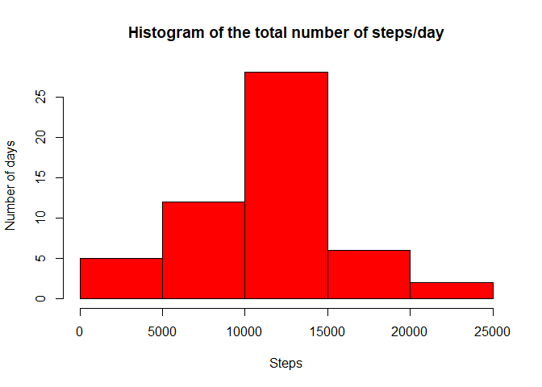
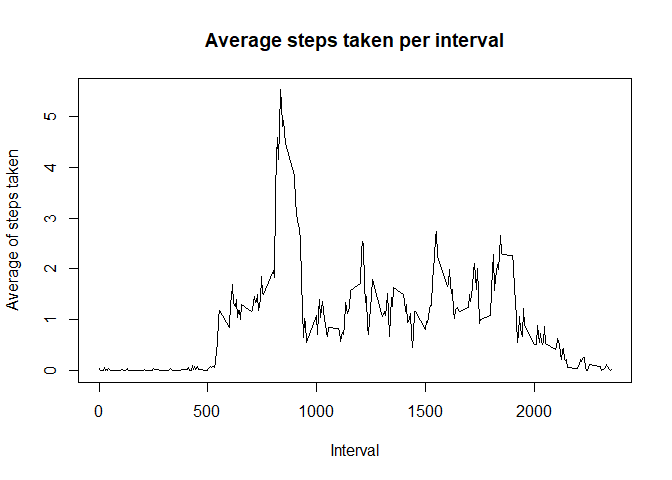
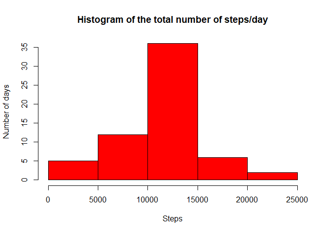
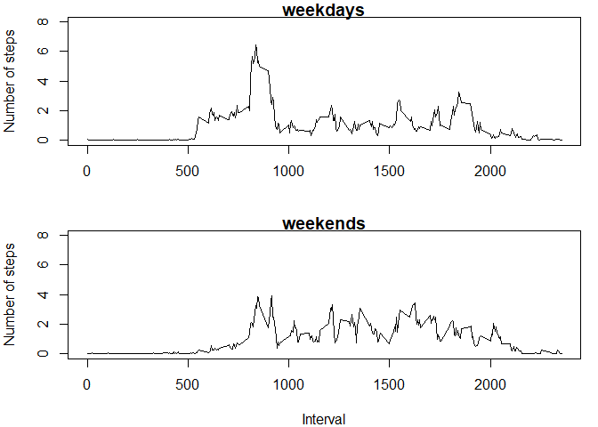

## Loading and preprocessing the data

Let´s set the global options. We set the option cache = TRUE to avoid compiling all the code chunks again and again. The plots are goint to
be placed in the Figure folder.

Set the working directory and read the .csv file

```r
setwd("~/3. Personal/JHU - Data Science/5. Reproducible Research/Assignment week 2/RepData_PeerAssessment1")
activity <- read.csv("activity.csv")
```
        
## What is mean total number of steps taken per day?

First, we ignore the missing values

```r
c_activity <- activity[complete.cases(activity),]
```
Calculate the total number of steps per day

```r
library(dplyr)
```

```
## 
## Attaching package: 'dplyr'
```

```
## The following objects are masked from 'package:stats':
## 
##     filter, lag
```

```
## The following objects are masked from 'package:base':
## 
##     intersect, setdiff, setequal, union
```

```r
t_steps <- c_activity %>% group_by(date) %>% summarize(total = sum(steps))
```
Make a histogram of the total number of steps taken each day

```r
hist(t_steps$total, col = "red", xlab = "Steps", ylab = "Number of days", main = "Histogram of the total number of steps/day")
```

<!-- -->

Calculate and report the mean and median of the total number of steps taken per day

```r
summary(t_steps$total)
```

```
##    Min. 1st Qu.  Median    Mean 3rd Qu.    Max. 
##      41    8841   10765   10766   13294   21194
```
The mean of the total number of steps taken per day is **10.766**. And the median is **10.765**.


## What is the average daily activity pattern?

First, we group by interval and calculate the total number of steps each 5 min. interval 

```r
library(dplyr)
interval <- c_activity %>% group_by(interval) %>% summarize(average = mean(steps))
```
Make a time series plot of the 5-minute interval (x-axis) and the average number of steps taken, averaged across all days (y-axis)

```r
plot(x = interval$interval, y = interval$average/mean(c_activity$steps), xlab = "Interval", ylab = "Average of steps taken", 
     type = "l", main = "Average steps taken per interval")
```

<!-- -->

```r
max_steps <-  max(interval$average)
max_inter <- as.numeric(interval[interval$average == max_steps, 1])
max_inter
```

```
## [1] 835
```

On average across all the days in the dataset, the 5-minute interval which contains the maximum number of steps is **835**

## Imputing missing values

Calculate and report the total number of missing values in the dataset (i.e. the total number of rows with NAs)

```r
number_NA <- nrow(activity) - nrow(c_activity)
number_NA
```

```
## [1] 2304
```
The total number of missing values is **2304**

Fill in all of the missing values in the dataset with the mean for that 5-minute interval.

```r
fill_activity <- activity
for (i in 1:nrow(activity))
{
        if (is.na(activity[i, 1])) 
        {
                fill_activity[i,1] <- interval[interval$interval == activity[i,3], 2]
        }
}
```

Make a histogram of the total number of steps taken each day

```r
library(dplyr)
t_steps_NA <- fill_activity %>% group_by(date) %>% summarize(total = sum(steps))
hist(t_steps_NA$total, col = "red", xlab = "Steps", ylab = "Number of days", main = "Histogram of the total number of steps/day")
```

<!-- -->


Calculate and report the mean and median total number of steps taken per day. 

```r
summary(t_steps_NA$total)
```

```
##    Min. 1st Qu.  Median    Mean 3rd Qu.    Max. 
##      41    9819   10766   10766   12811   21194
```
The mean and the median total number of steps per day is **10.766**. When imputing missing data, the median increases a little bit.


## Are there differences in activity patterns between weekdays and weekends?

### Create a new factor variable in the dataset with two levels – “weekday” and “weekend” 

Transform the date colunm in date format

```r
fill_activity$date <- as.Date(fill_activity$date)
```

Identify which date is weekend or weekday (note that in my computer R is set up in Spanish)

```r
library(lubridate)
```

```
## 
## Attaching package: 'lubridate'
```

```
## The following object is masked from 'package:base':
## 
##     date
```

```r
library(dplyr)

for (i in 1:nrow(fill_activity))
{
      if (weekdays(fill_activity$date[i]) == "sábado" || weekdays(fill_activity$date[i]) == "domingo")
      {
          fill_activity$week[i] <- "weekend"
      }
      else {fill_activity$week[i] <- "weekday"}   
}
```

Make a panel plot containing a time series plot of the 5-minute interval (x-axis) and the average number of steps taken, averaged across all weekday days or weekend days (y-axis).


```r
weekdays <- fill_activity[fill_activity$week == "weekday", ]
weekends <- fill_activity[fill_activity$week == "weekend", ]

library(dplyr)
avg_weekdays <- weekdays %>% group_by(interval) %>% summarize(average = mean(steps))
avg_weekends <- weekends %>% group_by(interval) %>% summarize(average = mean(steps))

par(mfrow = c(2, 1), mar = c(4, 4, 1, 1), oma = c(0, 0, 0, 0))

plot(x = avg_weekdays$interval, y = avg_weekdays$average/mean(weekdays$steps), xlab = "", ylab = "Number of steps", 
     type = "l", main = "weekdays", ylim = range(c(0,8)))

plot(x = avg_weekends$interval, y = avg_weekends$average/mean(weekends$steps), xlab = "Interval", ylab = "Number of steps", 
     type = "l", main = "weekends", ylim = range(c(0,8)))
```

<!-- -->


